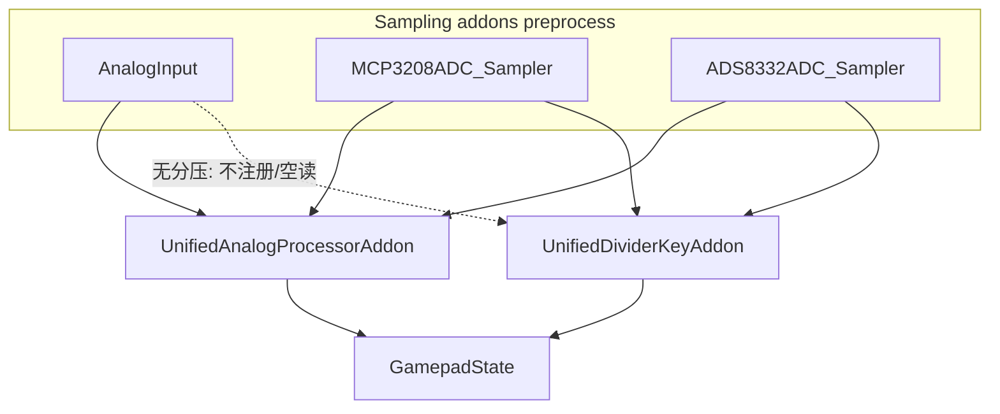

# 统一摇杆 + 统一分压键（修订方案）

## 架构调整（相对前一版）

- **摇杆**：继续在 [`unified_analog_processor.cpp`](file:///home/leonxis/GP2040/GP2040-CE/src/addons/unified_analog_processor.cpp) 中完成校准/死区/曲线/映射；支持 **12-bit（片内 ADC、MCP3208）与 16-bit（ADS8332）** 的归一化（按每源 `adc_max` 与 `half = adc_max/2` 缩放，中心值与 `AnalogOptions` 中已有字段一致）。
- **源启用与仲裁**：`UnifiedAnalogProcessorAddon::available()` 从“仅 `analogOptions.enabled`”改为“任一模拟采样源可用”（`analogOptions.enabled || mcp3208Options.enabled || ads8332Options.enabled`）；处理时按明确优先级 `ADS8332 > MCP3208 > AnalogInput` 选择每个 stick 的 raw 数据，避免多源并存时行为不确定。
- **轴路由统一策略**：所有采样源（onboard analog、MCP3208、ADS8332）统一遵循 `analogAdc1Mode/analogAdc2Mode` 配置进行写轴，不再保留来源特化的固定路由；确保同一配置在任意 ADC 源下输出语义一致。
- **通道定义统一层（含分压）**：针对 `mcp3208_adc` 与 `ads8332_adc`，新增与 [`analog.cpp`](file:///home/leonxis/GP2040/GP2040-CE/src/addons/analog.cpp) 类似的数据结构层。除摇杆 `x_channel/y_channel` 外，分压多档键也在同层定义（例如 `divider_left_channel/divider_right_channel`）；初始化方式为“硬编码赋值”。目标是让三类采样源在代码组织上保持同构：`analog.cpp` 从配置读取，MCP/ADS 在同结构中给默认通道值，便于统一调试与后续可配置化。
- **步长量化降采样（jitter/resolution）**：在 unified stick 流程内统一实现（与现 MCP3208 `getStickRaw` 语义对齐）：读取 `AnalogOptions.joystick_jitter_filter_1/_2`，对每 stick、每轴按 `step` 做四舍五入量化并夹紧到 `[0, adc_max]`；为避免跨帧抖动回跳，保留每轴 `last_*_adc` 缓存。这样 MCP3208/ADS8332/片内 ADC 都走同一套精度控制逻辑。
- **分压多档键（原 MCP CH2/CH5）**：**不**放入 unified analog；新增独立 addon（建议名 **`UnifiedVoltageSwitchAddon`** 或 **`UnifiedDividerKeyAddon`**），专门做阈值分档、防抖、写入 `gamepad` 的 buttons/dpad、`addonKeyboardKeyMask`、`addonMouseButtonMask`，逻辑从当前 [`mcp3208_adc.cpp`](file:///home/leonxis/GP2040/GP2040-CE/src/addons/mcp3208_adc.cpp) 的 `buildCh25Maps` / `applyCh2Ch5Keys` 迁出并复用（含 `FnKeyMappingOptions`、与现有一致的「只清除本插件上一帧输出」语义）。

## 采样源与分压键的区分

- **MCP3208**：`preprocess` 继续读 CH0/1/6/7 与 CH2/5（现有降采样策略可保留）；提供静态或实例方法供摇杆统一处理读 raw sticks；**另提供 CH2/CH5 原始值**（或 `uint16_t ch2, ch5` + `adc_max=4095`）给分压插件。`process()` 不再写摇杆、不再 `applyCh2Ch5Keys`。
- **ADS8332**：`preprocess` 缓存 CH0/1/6/7 以及 **CH2/CH5** raw（16-bit）；`process()` 不写 gamepad；供 unified analog 与 unified divider 消费。分压插件默认按 CH2/CH5 判档，并使用 ADS8332 的 `adc_max=65535` 做阈值归一化（建议把 MCP 的电压阈值转换为比例阈值，按 `threshold_ratio * adc_max` 生成运行时阈值）。
- **AnalogInput**：无分压通道；分压插件 **`UnifiedDividerKeyAddon::available()`** 在「`mcp3208Options.enabled || ads8332Options.enabled` 且采样就绪」时为 true；若当前帧没有任一分压源有效数据则 no-op——从而 **天然区分** analog-only 板子。
- **统一 raw 接口约束**：为统一处理插件提供标准返回结构（示例：`rawX/rawY/xCenter/yCenter/xValid/yValid/adcMax/sourceType`），并带 `sourceReady` 标志；避免 unified 依赖某个具体 addon 的硬编码入口。
- **通道映射一致性约束**：统一处理插件读取的是“采样插件已按其 `x_channel/y_channel` 组织后的 stick raw”，不直接假设 CH0/1/6/7 等固定编号；MCP/ADS 内部仍可用硬编码默认值，但通过统一配置结构暴露，便于调试时单点修改。
- **分压通道一致性约束**：分压插件读取的是采样插件在统一定义层声明的 `divider_left_channel/divider_right_channel` 原始值，不在分压插件中硬编码 CH2/CH5；MCP/ADS 默认仍可设为 2/5，但应通过同一配置结构暴露，便于调试替换。

## Addon 加载顺序（[`gp2040.cpp`](file:///home/leonxis/GP2040/GP2040-CE/src/gp2040.cpp)）

建议顺序（保证同一帧内 preprocess 先填满缓存，再写 sticks，再写分压键，避免互相覆盖）：

1. `AnalogInput`（若 `analogOptions.enabled`）
2. `MCP3208ADCAddon`
3. `ADS8332ADCAddon`
4. `UnifiedAnalogProcessorAddon`（`available()`：`analogOptions.enabled || mcp3208Options.enabled || ads8332Options.enabled`，与采样侧一致）
5. **`UnifiedDividerKeyAddon`**（`available()`：`(mcp3208Options.enabled || ads8332Options.enabled) && sourceReady`）

分压插件应排在 unified stick **之后**，以便按键叠加在已更新的 gamepad 状态上（与原 MCP 在单插件内先摇杆后 CH2/5 的顺序一致）。

## MCP3208 精简

- 删除与摇杆曲线/死区/量程重复的 `adc_pairs_` 大块逻辑，仅保留 SPI、`adcValues_[]`、抖动量化（可与 analog 行为对齐）、`getRawStickForWebConfig` 与供 unified 读取的 API。
- CH2/CH5 的 debounce 状态移至 **分压统一插件**（或保留在 MCP 仅作 raw 提供方，debounce 在分压插件——推荐 debounce 与映射同在分压插件，MCP 无状态除 ADC 缓存）。

## ADS1219 / ADS1256 移除（范围不变）

- 从 [`proto/config.proto`](file:///home/leonxis/GP2040/GP2040-CE/proto/config.proto) 移除 `AnalogADS1219Options` / `AnalogADS1256Options` 及 `AddonOptions` 中对应字段（可按需 `reserved` 原 field 号）；重新生成 nanopb。
- 删除后端 addon 源/头、[`gp2040.cpp`](file:///home/leonxis/GP2040/GP2040-CE/src/gp2040.cpp) 注册、[`CMakeLists.txt`](file:///home/leonxis/GP2040/GP2040-CE/CMakeLists.txt) 与 [`lib/CMakeLists.txt`](file:///home/leonxis/GP2040/GP2040-CE/lib/CMakeLists.txt) 中 ADS1219/ADS1256 库链接；清理 [`analog_utils.cpp`](file:///home/leonxis/GP2040/GP2040-CE/src/addons/analog_utils.cpp)、[`webconfig.cpp`](file:///home/leonxis/GP2040/GP2040-CE/src/webconfig.cpp)、[`config_utils.cpp`](file:///home/leonxis/GP2040/GP2040-CE/src/config_utils.cpp)、[`config_legacy.cpp`](file:///home/leonxis/GP2040/GP2040-CE/src/config_legacy.cpp) 中相关分支。
- 前端：移除 [`I2CAnalog1219.tsx`](file:///home/leonxis/GP2040/GP2040-CE/www/src/Addons/I2CAnalog1219.tsx)、[`Analog1256.tsx`](file:///home/leonxis/GP2040/GP2040-CE/www/src/Addons/Analog1256.tsx) 及 [`AddonsConfigPage.tsx`](file:///home/leonxis/GP2040/GP2040-CE/www/src/Pages/AddonsConfigPage.tsx)、[`CalibrationSettings.tsx`](file:///home/leonxis/GP2040/GP2040-CE/www/src/Pages/HMLSettings/components/CalibrationSettings.tsx) 中的 scheme/state 与各 locale 字符串；**勿动** `AnalogOptions`、`FnKeyMappingOptions`、`MCP3208Options`、`ADS8332Options` 等共用消息。

## 关键新增/修改文件

| 动作 | 路径 |
|------|------|
| 新增 | [`headers/addons/unified_voltage_switch.h`](file:///home/leonxis/GP2040/GP2040-CE/headers/addons/unified_voltage_switch.h)（名称以最终实现为准） |
| 新增 | [`src/addons/unified_voltage_switch.cpp`](file:///home/leonxis/GP2040/GP2040-CE/src/addons/unified_voltage_switch.cpp) |
| 修改 | [`unified_analog_processor.cpp/.h`](file:///home/leonxis/GP2040/GP2040-CE/src/addons/unified_analog_processor.cpp) — 多 bit 深度 + 多源 raw 选择；**无** CH2/CH5 |
| 修改 | [`mcp3208_adc.cpp/.h`](file:///home/leonxis/GP2040/GP2040-CE/src/addons/mcp3208_adc.cpp)、[`ads8332_adc.cpp/.h`](file:///home/leonxis/GP2040/GP2040-CE/src/addons/ads8332_adc.cpp) — 采样与 API |
| 修改 | [`gp2040.cpp`](file:///home/leonxis/GP2040/GP2040-CE/src/gp2040.cpp)、[`CMakeLists.txt`](file:///home/leonxis/GP2040/GP2040-CE/CMakeLists.txt) |

## 验证要点

- MCP3208：双摇杆与 CH2/CH5 行为与迁移前一致（防抖、键盘/鼠标位、与 Fn 映射）。
- ADS8332：摇杆经 unified 后范围与驱动 `joystickMax` 一致；**CH2/CH5 分压键默认生效**，并与 MCP 规则一致（含防抖与掩码释放语义）。
- 仅 onboard analog：无分压插件或分压插件 no-op，无多余按键。
- 多源并存：同一帧内 stick 数据选择稳定且符合 `ADS8332 > MCP3208 > AnalogInput`，禁用/启用任一源后无抖动性跳变。
- 轴路由：onboard/MCP3208/ADS8332 在相同 `analogAdc1Mode/analogAdc2Mode` 配置下写轴结果一致，不存在来源相关分叉语义。
- 轴通道调试：MCP/ADS 的 `x_channel/y_channel` 默认硬编码值可在统一结构中调整；调整后 unified 输出随之变化，无需改 unified 主处理逻辑。
- 分压通道调试：MCP/ADS 的 `divider_left_channel/divider_right_channel` 默认硬编码值（初始可为 CH2/CH5）可在统一结构中调整；调整后分压按键输出随之变化，无需改 unified divider 主逻辑。
- WebConfig 校准：`readJoystickADC` 链在去掉 1219/1256 后为 ADS8332 → MCP3208 → 片内 ADC。
